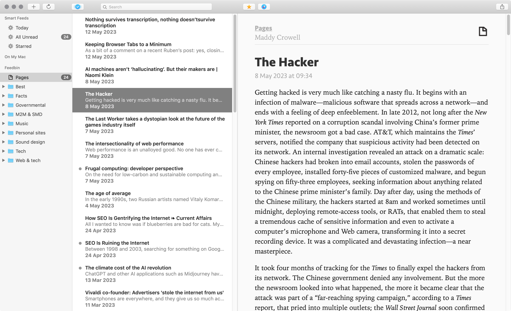
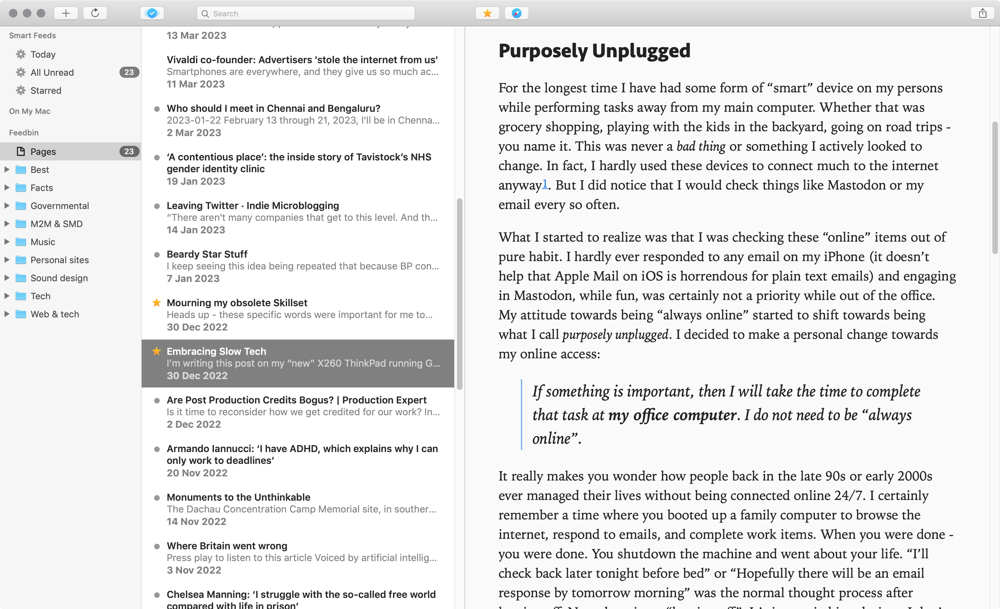
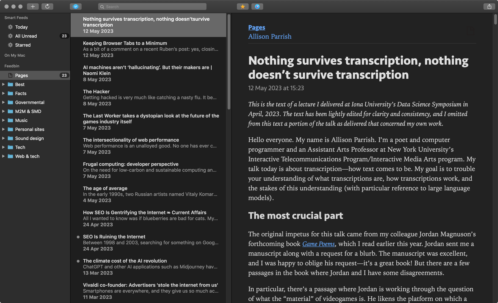
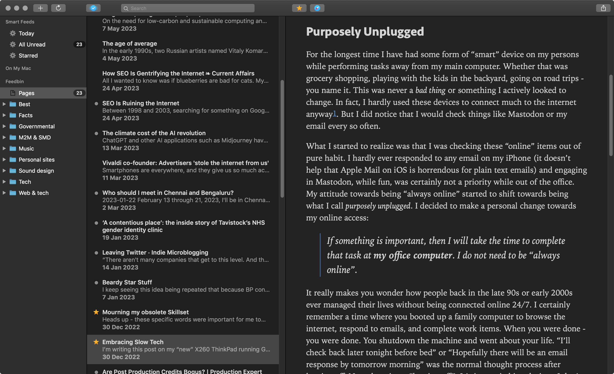

# Netnewswire 5 - Custom CSS theme

Custom theme for NetNewsWire v5. 

Since my macOS is Mojave, I can't upgrade to NetNewsWire v6. This custom theme was created by [Luke Harris](https://github.com/lkhrs/nnw-minutes) based on my website. I added minor customisations.

It features the same typography used of other interfaces I've been using:

- Seravek for headings and UI elements
- Iowan Old Style for body copy

## Installation

- Go to `/Applications/`
- Find `NetNewsWire.app`
- Right-click and choose <kbd>Show Package Contents</kbd>
- Open `Contents`
- Open `Resources`
- Copy `styleSheet.css`

## Examples

### Prefer: bright

***

### Prefer: dark

***

